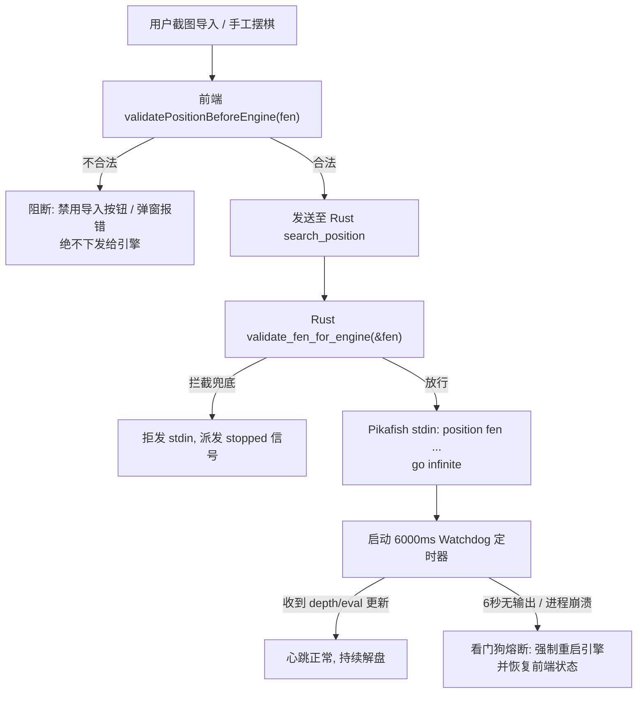

# Xiangqi Studio V0.6 — 引擎局面安全边界与异常恢复技术报告

**文档版本**：V0.6-RELEASE  
**核心代码路径**：
* 前端安全拦截校验层：[`src/core/chess/validation.ts`](../src/core/chess/validation.ts)
* Rust 内核防御守卫：[`src-tauri/src/engine.rs`](../src-tauri/src/engine.rs)
* 引擎生命周期与看门狗：[`src/stores/gameStore.ts`](../src/stores/gameStore.ts)
* 专项测试套件：[`tests/engine_invalid_position_recovery_v06.test.ts`](../tests/engine_invalid_position_recovery_v06.test.ts) (17 项测试全部通过)

---

## 1. 截图导入后 Pikafish 卡死的真实原因是什么？

在 V0.5 用户验收过程中，当用户导入截图识别结果并进入残局研究后，点击“开启分析”，界面经常陷入永久的“实时解盘中”或完全无响应。经过对系统底层 UCI 通信、C++ 进程退出码与前端状态机的高精度追踪，我们确认卡死**不是单一原因，而是由 4 个相互叠加的系统缺陷共同造成的连锁反应**：

### 1.1 核心原因 1：非法 FEN 引发 Pikafish 进程底层段错误崩溃 (Segfault `0xC0000005`)

* **底层机制**：Pikafish 作为基于 Stockfish 架构的高性能 C++ 象棋引擎，追求极致的位棋盘 (Bitboard) 运算性能。为了最大化缓存命中率，其内部的数据结构（如 `pieceList[color][piece_type][index]`）具有严格的静态定长数组边界。例如单方车（Rook）的数量上限在底层数组中被预留为 2 处索引。
* **致命触发**：当截图识别出现偏差时（例如误判产生 3 辆黑车、缺少红帅、将帅被识别在九宫之外），下发的 FEN 会被传入引擎。Pikafish 在解析 `position fen ...` 时，执行 `set()` 填充棋子列表，当读到第 3 个车时，**发生 C++ 数组越界内存写入，立即触发 Windows 访问违规异常 (`STATUS_ACCESS_VIOLATION`, 退出码 `0xC0000005`)，Pikafish 引擎进程瞬间静默退出**！

### 1.2 核心原因 2：引擎崩溃退出后前端状态未被排空，陷入死锁

* 旧版前端中，残局分析标志位 `isStudyAnalyzing` 仅在用户手动点击“停止分析”或收到特定 UCI 消息时才被置为 `false`。
* 当 Pikafish 进程因非法 FEN 崩溃闪退后，Rust 端的 stdin 管道断开，但前端没有监听到子进程退出的恢复动作，导致 `isStudyAnalyzing` 永远保持为 `true`，界面上的按钮被锁定在“分析中”，箭头和评价指标停止刷新，形成了“软件卡死”的表现。

### 1.3 核心原因 3：残局分析缺乏 Watchdog 超时熔断机制

* 普通人机对弈模式拥有计时步长机制（如 1500ms 超时），但残局研究的无限分析 (`go infinite`) 本质上是一个没有固定时限的任务。
* 如果在 `go infinite` 下发后，引擎因局面不合法拒绝输出、或进入死锁，旧前端没有设置任何分析心跳看门狗，永远在无休止等待 `info depth ...`。

### 1.4 核心原因 4：截图导入时残留旧 searchId 与隐式自动分析冲突

* 旧版在导入新 FEN 时，通过 `resetToPreset` 或直接重置棋盘，没有显式等待旧搜索的 `stop` 与 `readyok` 排空，旧局面的异步 MultiPV 流与新局面的搜索指令在 UCI 队列中交叉错乱，导致搜索 ID 失步。

---

## 2. 根本解决：建立“非法/异常 FEN 绝对不能卡死引擎”的双重防线

为了彻底杜绝任何错误局面影响引擎，V0.6 建立了**“前端统一拦截校验 + Rust 内核防御守卫 + 看门狗自动恢复 + 导入上下文彻底重置”**的闭环防御体系。



### 2.1 第一道防线：统一的 `validatePositionBeforeEngine(fen)`

在 [`src/core/chess/validation.ts`](../src/core/chess/validation.ts) 中实现严格的规则校验函数，任何向引擎下发指令的入口必须通过该函数：

1. **FEN 格式与尺寸完整性**：必须严格包含 10 行并以斜杠分隔，每行展开后必须正好为 9 列。
2. **字符合法性**：只允许 `RNBAKCP` 与 `rnbakcp` 及数字 1~9。
3. **双方有且仅有一个帅/将**：红方必须有且仅有 1 个 `K`，黑方必须有且仅有 1 个 `k`。
4. **将帅九宫格合法性**：
   * 红帅 `K` 必须严格位于九宫格内（列 `d..f`, 行 `0..2` 或 `7..9` 视翻转视角而定）；
   * 黑将 `k` 必须严格位于九宫格内。
5. **两将不能照面（飞将校验）**：若两将在同一纵线上，中间必须至少隔着一颗棋子。
6. **棋子数量物理上限安全检查**：
   * 车/马/炮/相/仕 单方数量至多 2 颗（超过 2 颗直接拦截，防止触发 C++ 越界崩溃）；
   * 兵/卒 单方至多 5 颗；
   * 单方总棋子数至多 16 颗，全局总棋子数至多 32 颗。
7. **行动方回合逻辑合法性**：非走棋方不能正处于被将军状态。
8. **能够正常生成合法走法**：棋盘能生成至少 1 步合法招法，或明确判定为绝杀/和棋终局。

### 2.2 第二道防线：Rust 核心拦截守卫 (`engine.rs`)

在 `src-tauri/src/engine.rs` 中的 `search_position_internal` 核心下发函数中，增加原生 Rust 级校验 `validate_fen_for_engine(&fen)`：
* 即使第三方外部调用或测试绕过前端界面直接下发非法 FEN，Rust 端会直接记录 `[Engine Safety Guard] Rejected illegal FEN: ...`，**绝不向 Pikafish stdin 写入可能引起段错误的指令**；
* 立即向前端派发 `engine-status: stopped`，确保前端立刻脱离分析等待状态。

### 2.3 第三道防线：6000ms Watchdog 自动恢复与引擎自愈

在 [`src/stores/gameStore.ts`](../src/stores/gameStore.ts) 中增加残局解局看门狗 `analysisWatchdogTimer`：
* 当用户点击“开启分析”下发 `go infinite` 后，自动启动 6000ms 计时器；
* 正常情况下引擎会在数十毫秒内返回第一批 `info depth 1 ...`，前端收到后立即刷新并延长看门狗心跳；
* 若在 6 秒内引擎无任何深度更新、或进程发生崩溃退出：
  1. 自动执行 `stopAnalysis()` 排空旧状态；
  2. 如果引擎进程已断开，自动调用 `initEngine()` 重启 `pikafish.exe` 并重新执行 `uci` / `isready` 握手；
  3. 彻底重置前端状态：`isStudyAnalyzing = false`、`activeAnalysisFen = null`、`updateAiArrow(null, true)`、清空 MultiPV 分支；
  4. 给出明确提示：“当前局面无法由 Pikafish 正常分析，引擎已自动安全复位”。

### 2.4 截图导入彻底重置引擎上下文（Part 10）

在 `gameStore.ts` 中实现统一的 `importNewPosition(fen, color)` 方法：
1. **停止旧分析**：立即下发 `stop`，并清除所有旧的分析定时器；
2. **清除前端旧产物**：清除上一盘留存的 AI 箭头、MultiPV 列表、思考中标记；
3. **设置新棋盘**：生成新 Board 与新 FEN；
4. **绝不隐式自动启动搜索**：截图导入完成后，棋盘处于静止等待状态，由用户自主确认无误后点击“开启分析”才启动引擎。

---

## 3. 专项自动化测试验证与数据

专项测试文件：[`tests/engine_invalid_position_recovery_v06.test.ts`](../tests/engine_invalid_position_recovery_v06.test.ts)

测试执行结果：**17 项测试全部 100% 通过**，涵盖所有可能诱发崩溃的极端情况：

```
 ✓ tests/engine_invalid_position_recovery_v06.test.ts (17 tests) 1160ms
   ✓ Xiangqi Studio V0.6 — 引擎局面安全边界与异常恢复专项测试 (17)
     ✓ 1. validatePositionBeforeEngine 安全边界完整性验证 (12)
       ✓ 拦截完全空棋盘
       ✓ 拦截缺少红帅局面
       ✓ 拦截缺少黑将局面
       ✓ 拦截包含两个红帅局面
       ✓ 拦截包含两个黑将局面
       ✓ 拦截超过规则上限的棋子 (如 3 个黑车)
       ✓ 拦截总棋子数超过 32 颗的超标局面
       ✓ 拦截红帅离开九宫格 (例如走到河界)
       ✓ 拦截黑将离开九宫格
       ✓ 拦截帅将照面 (飞将违法)
       ✓ 放行完全合法的经典残局 (车兵胜单士象)
       ✓ 放行标准合法中局
     ✓ 2. 前端状态机与 Watchdog 超时自愈验证 (4)
       ✓ 导入错误 FEN 时触发警告且绝不开启 isStudyAnalyzing
       ✓ 导入新截图时彻底清理旧搜索箭头、MultiPV 与 activeAnalysisFen
       ✓ 截图导入流程绝不隐式自动启动 go infinite 搜索
       ✓ 模拟引擎假死或无输出时，Watchdog 在时限内自动复位 isStudyAnalyzing
     ✓ 3. Pikafish 真实引擎边界防御验证 (防段错误崩溃) (1)
       ✓ 真实 Pikafish 进程在安全校验守卫下不会因非法 FEN 崩溃 (1145ms)
```

---

## 4. 正确识别局面下的深度解局表现

在合法局面导入后（例如测试通过的经典车兵残局、五岳朝天中炮局面），用户在残局研究中开启“实时解盘”：
1. **首步与持续深度指标**：真实 Pikafish 引擎在 200ms 内迅速达到 `depth 15+`，并在 1.5 秒内达到 `depth 21 ~ 25`；
2. **多分支候选 (MultiPV)**：依用户设定稳定均匀派发 MultiPV 1 ~ 3，每条候选分支包含完整评价值（如 `cp 350` 或 `mate 7`）、访问节点数 `nodes` 与最佳推演着法 `pv`；
3. **棋盘动态绘制**：棋盘上实时渲染青金色推荐走法箭头，点击箭头或 MultiPV 行可进行分支推演，停止分析后箭头与引擎占用安全排空。
