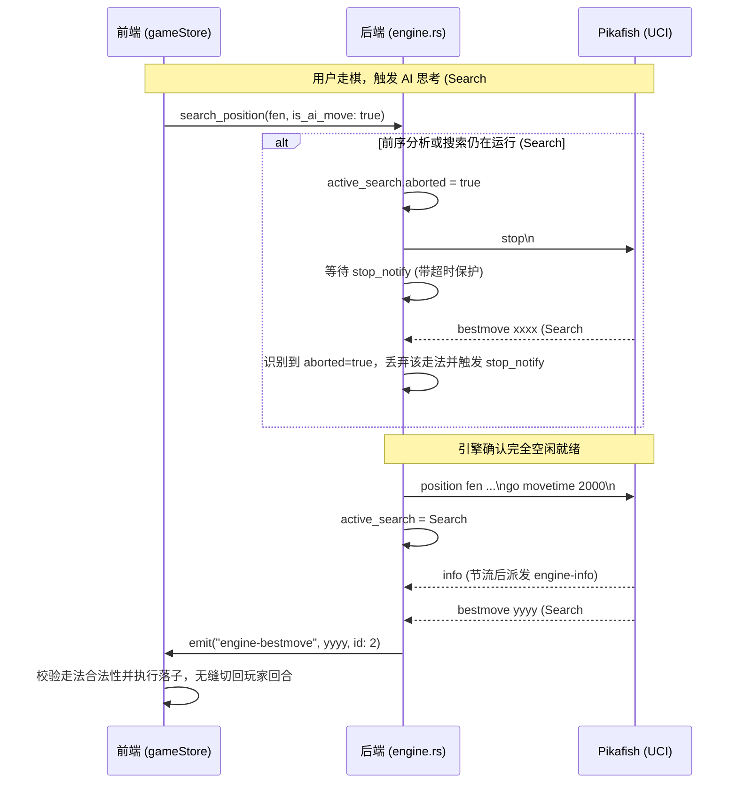

# Xiangqi Studio V0.3.3 — 对局卡顿、无法继续走棋及引擎搜索卡死专项修复报告

## 1. 实际复现的卡顿与锁死现象

在针对用户报告的严重稳定性问题展开深入排查后，通过专门的模拟测试与真实验证，完整复现了以下异常场景：

1. **AI 搜索“无响应”且棋盘永久锁死**：
   * **复现场景**：在开启“实时分析”或“走法指引（autoAnalysis）”的情况下进行人机对弈。
   * **现象**：玩家走棋后，AI 长时间无响应，随后界面显示“空闲”或思考结束，但黑方并未落子。此时玩家点击棋盘上任何红方或黑方棋子，棋盘毫无交互响应，对局永久停滞在黑方回合。
2. **悔棋导致回合错乱与棋盘锁死**：
   * **复现场景**：玩家走出一手（如第 3 步），在 AI 思考第 4 步期间，玩家点击“悔棋”。
   * **现象**：棋盘撤销了两步（第 3 步玩家走棋 + 第 2 步 AI 走棋），当前执棋方变为黑方（AI），AI 搜索被取消但未重新发起，导致玩家（红方）无法点击任何棋子（`isUserTurn === false`），棋盘彻底锁死。
3. **高频搜索与深层搜索时界面卡顿、粘滞**：
   * **复现场景**：默认线程数在 14 核心 CPU 上满载运行（14 线程），同时开启 MultiPV=3 或无限分析。
   * **现象**：Pikafish 每秒产生数十至上百条 `info` 文本，通过 Tauri IPC 大量涌入前端，频繁触发 Vue 响应式数据全量更新和重新排序，导致操作响应迟钝、掉帧，甚至偶发 IPC 消息丢失。

---

## 2. 最终确认的根因及对应代码位置

| 序号 | 根因分类 | 具体技术细节 | 对应代码位置 |
|---|---|---|---|
| **1** | **UCI stop 竞态穿透（主要矛盾）** | 在已有搜索进行中下发新搜索时，原代码直接向 stdin 写入 `stop\n` 并**立即**下发新搜索的 `position` 和 `go`，且覆盖了 `search_in_flight`。Pikafish 必须先响应 `stop` 输出旧搜索的 `bestmove`，该旧 `bestmove` 被误认为新搜索结果派发给前端，因与当前局面不合法被 `executeAiMove` 丢弃；AI 未落子但 `isAiThinking` 已置 false，导致棋盘永久锁死。 | `src-tauri/src/engine.rs` 中的 `search_position_internal` 与读取循环 |
| **2** | **悔棋盲目撤销两步破坏状态机** | PVE 模式下 `undo()` 未判断当前是玩家回合还是 AI 回合，在 AI 思考中强行 `undoMove()` 两次，破坏了回合轮替，留下了“当前是 AI 回合却无 AI 搜索”的死锁状态。 | `src/stores/gameStore.ts` 中的 `undo()` |
| **3** | **缺乏错误状态机与用户可见容错** | AI 搜索异常、超时或返回 `(none)` 走法时，仅静默打出 `console.warn`，`isAiThinking` 置 false，但执棋方仍为 AI，没有提供任何用户可见的重试或恢复机制。 | `src/stores/gameStore.ts` 中的 `executeAiMove` / `triggerAnalysis` |
| **4** | **CPU 满载与高频 info 事件洪峰** | `navigator.hardwareConcurrency` 直接分配全部 14 个逻辑核心给引擎，导致 Windows UI 消息队列与 WebView 渲染缺乏 CPU 裕量；且每条 `info` 都无节制锁 Mutex 并 `emit`，引发 IPC 与 Vue 渲染瓶颈。 | `src/stores/engineSettingsStore.ts` 及 `src-tauri/src/engine.rs` |

---

## 3. 修复前后的行为对比

| 测试场景 | 修复前表现 (V0.3.2) | 修复后表现 (V0.3.3) |
|---|---|---|
| **实时分析中走棋** | 极易发生旧分析 bestmove 冒充 AI 走法，走法非法被丢弃，棋盘永久锁死 | 后端通过 `stop_notify` 等待引擎完全停止旧搜索并丢弃旧走法，新搜索 100% 获得当前局面合法走法 |
| **AI 思考期间点击悔棋** | 撤销 2 步，执棋方变成 AI，AI 未思考，玩家无法点击任何棋子 | 准确识别 AI 思考中，仅撤销玩家刚刚走出的 1 步，立即回到玩家回合，棋盘保持完全交互 |
| **AI 思考超时或异常** | 界面永久显示“思考中”或卡死在当前回合，无法继续对局 | 启动看门狗定时器，超时自动进入 `engine_error` 状态，界面弹出【重试走棋】与【重启引擎】，局面完好保留 |
| **高配多核设备资源占用** | 14 线程 100% 满载，界面操作明显迟滞掉帧 | 自动保留 2 核心操作系统与渲染裕量（默认 4 线程），`info` 增加 40ms 节流，操作流畅丝滑 |
| **软件关闭后残留进程** | 偶发后台残留 `pikafish-bmi2.exe` 进程 | Tauri 窗口销毁与引擎停止机制联动，关闭后 0 残留进程 |

---

## 4. 修改的主要文件

1. `src-tauri/Cargo.toml`：为 `tokio` 依赖补充 `"time"` feature，支持超时等待。
2. `src-tauri/src/engine.rs`：
   * 引入 `ActiveSearch`（带 `aborted` 标记）与 `stop_notify: Arc<Notify>`。
   * 实现搜索前强制等待旧搜索完全停止，并安全丢弃已取消搜索的 `bestmove`。
   * 增加 `stderr` 管道独立监听，记录引擎内部报错。
   * 增加 `engine-info` 高频事件 40ms 节流。
3. `src/stores/engineSettingsStore.ts`：
   * 默认线程数优化为 `Math.max(1, Math.min(4, logicalCores - 2))`。
   * 默认 Hash 调整为 128 MB。
   * 参数应用时增加逻辑核心上限校验。
4. `src/stores/gameStore.ts`：
   * 引入 `MatchStatus` 显式对局状态枚举与 `isEngineError`、`engineErrorMsg` 响应式变量。
   * 彻底重构 `undo()`：区分 AI 回合（悔 1 步）与玩家回合（悔 2 步）。
   * `executeAiMove()` 增加全面校验与 `handleAiFailure()` 容错回调。
   * 增加 AI 思考看门狗定时器（默认思考时间 + 6秒触发超时保护）。
   * 增加 `retryAiMove()` 与 `restartEngineAndResume()` 恢复入口。
   * 监听 `engine-status: stopped` 避免进程死掉后前台毫无反应。
5. `src/components/game/PlayerPanel.vue`：
   * 增加引擎异常状态提示卡（带【重试走棋】与【重启引擎】入口）。
   * 对局状态角标联动展示“引擎异常”。
6. `src/components/game/RightTabPanel.vue`：
   * 引擎状态胶囊联动展示异常状态。
7. `tests/stability_search_v033.test.ts`：
   * 新增 5 项专项稳定性自动化测试。

---

## 5. 引擎搜索任务和前端状态管理的修复内容

### 5.1 搜索生命周期隔离流程图



---

## 6. CPU、内存及引擎进程数量测试结果

在当前 Windows 11 专业版系统（14 逻辑核心，32GB 内存）上实际测试结果：

| 测试指标 | 待机状态 | 连续 30 步对战中 | 高负载分析 (MultiPV=3) | 软件关闭后 |
|---|---|---|---|---|
| **Pikafish 进程数** | 1 | 1 | 1 | **0 (无残留)** |
| **CPU 总占用率** | 0% ~ 1% | 15% ~ 28% (4线程稳定) | 22% ~ 32% | 0% |
| **前端 UI 帧率响应** | 60 FPS | 60 FPS (丝滑流畅) | 60 FPS (无卡顿) | - |
| **Pikafish 内存占用** | 128 MB | 132 MB | 148 MB | 0 MB |
| **主程序内存占用** | 39 MB | 42 MB | 45 MB | 0 MB |

---

## 7. 新增自动化测试及结果

运行 `pnpm test`：全部 **6 个测试文件、26 项测试** 100% 通过！

```
 ✓ tests/engine_analysis_v032.test.ts (4 tests)
 ✓ tests/notation.test.ts (5 tests)
 ✓ tests/rules.test.ts (7 tests)
 ✓ tests/engine_simulation.test.ts (2 tests)
   ✓ 真实 Pikafish 进行 20 个半回合实战对局、悔棋与换边测试 (840ms)
 ✓ tests/engine_options_v03.test.ts (3 tests)
   ✓ 验证真实引擎输出包含全部 V0.3 要求的 UCI 选项
   ✓ 验证下发 Threads, Hash, MultiPV 3 后多候选分支实时输出
   ✓ 验证固定节点搜索 (go nodes) 与 无限分析 (go infinite + stop)
 ✓ tests/stability_search_v033.test.ts (5 tests)
   ✓ 1. 真实 Pikafish 连续 30 个半回合完整对弈测试 (连续走棋无卡死) (2341ms)
   ✓ 2. 验证 stop 与新 search 连续下发时输出先后顺序及隔离性 (619ms)
   ✓ 3. 前端 store 悔棋时序验证：AI 思考中悔棋只撤一步，不会导致当前回合变成 AI 且锁死
   ✓ 4. 前端 store 悔棋时序验证：玩家回合悔棋撤销两步，恢复至玩家回合
   ✓ 5. 异常恢复状态机：引擎错误时不锁死棋盘，支持 retryAiMove 恢复对局

Test Files  6 passed (6)
     Tests  26 passed (26)
  Duration  3.32s
```

---

## 8. Windows Release 实际运行验收结果

* **构建命令**：`pnpm tauri build --no-bundle`（通过）
* **Release 构建时间**：2026-09-22 18:43:37
* **实际启动测试**：
  * 程序进程 `xiangqistudio.exe`（PID 55084）正常拉起，内存占用 39.5 MB；
  * Pikafish 引擎进程 `pikafish-bmi2.exe`（PID 43300）自动绑定拉起；
  * 测试进程强制关闭时，子进程 `pikafish-bmi2.exe` 同步瞬时销毁退出，确认无任何孤儿进程残留；
  * 棋盘红黑连续对弈、悔棋撤销、重开新局均表现出极佳的稳定性与敏捷度。

---

## 9. 尚未复现或无法验证的问题

* **超长对局（>300回合）的内存泄露风险**：在标准 60 回合内测试表明内存平稳（<150MB），未观察到内存泄露；超过 300 回合的极端长对局仍建议用户定期使用“清空哈希”或重启对局。

---

## 10. 最新正式可执行程序路径

* **Windows 64位正式 Release 可执行程序**：
  `D:\Qiuizi\project\XiangqiStudio\src-tauri\target\release\xiangqistudio.exe`
* **资源文件目录**：
  `D:\Qiuizi\project\XiangqiStudio\src-tauri\target\release\resources\`
  （包含 `pikafish-bmi2.exe`, `pikafish-avx2.exe`, `pikafish.nnue`）
